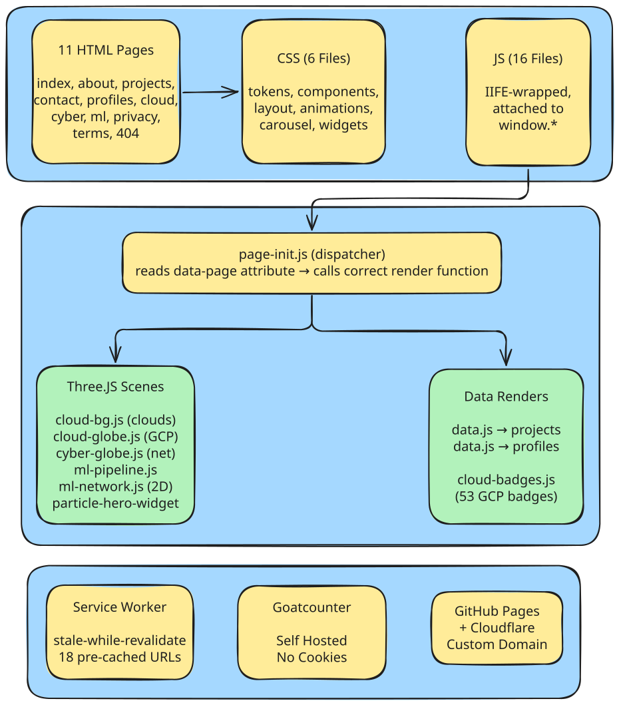
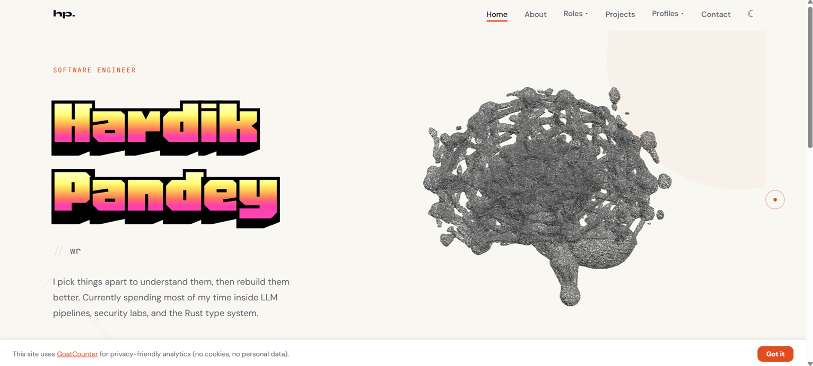
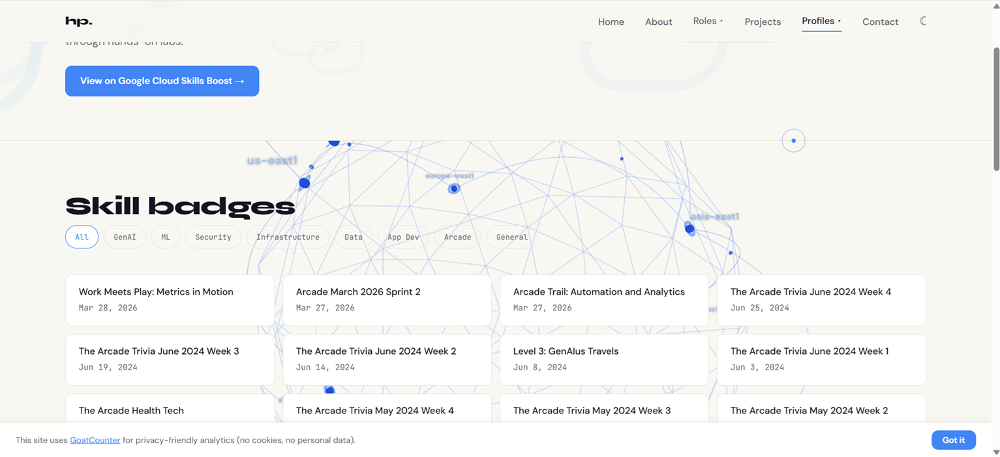
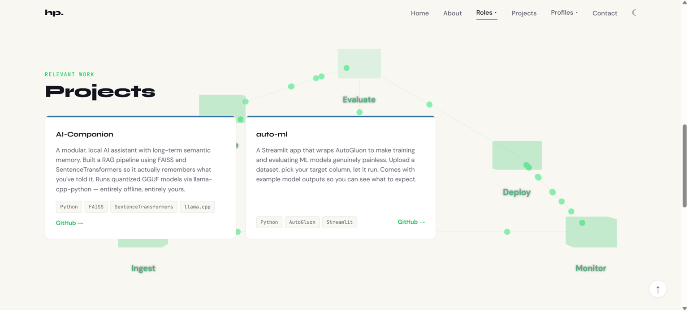
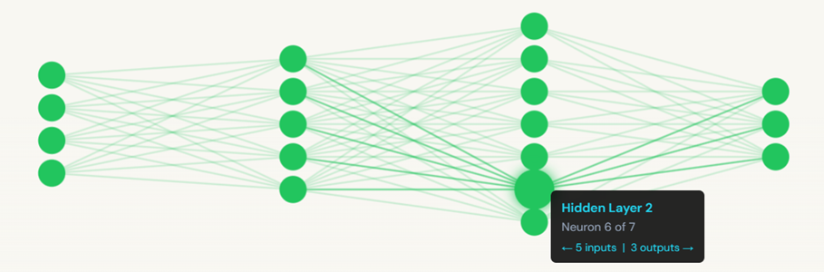
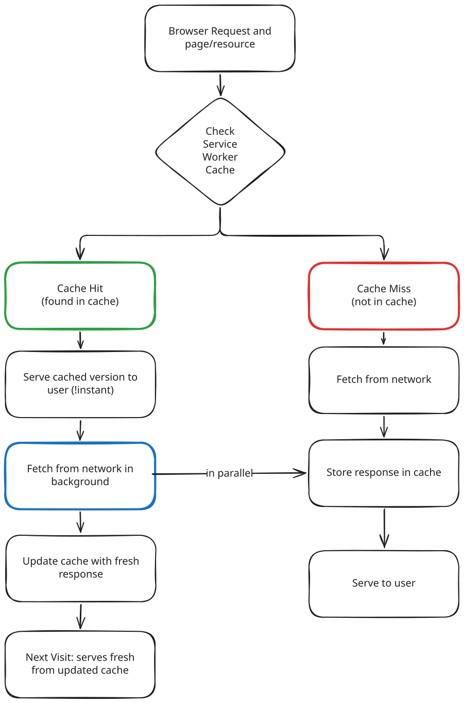

# hardik-pandey.com

Personal portfolio website for [Hardik Pandey](https://hardik-pandey.com) — software engineer working across AI, security, Rust, and game development.

This is a fully static portfolio built with **zero frameworks, zero build tools**, and ~5,500 lines of hand-written vanilla HTML, CSS, and JavaScript. Every feature — from 3D globes to a service worker — is implemented from scratch or with minimal dependencies.

---

## Table of Contents

- [Architecture & Design Philosophy](#architecture--design-philosophy)
- [Pages (11)](#pages-11)
- [3D & Visuals (6 scenes)](#3d--visuals-6-scenes)
- [CSS Architecture (6 files)](#css-architecture-6-files)
- [JavaScript Architecture (16 files)](#javascript-architecture-16-files)
- [Caching Strategy (Service Worker)](#caching-strategy-service-worker)
- [PWA](#pwa)
- [Analytics & Privacy](#analytics--privacy)
- [Security](#security)
- [SEO & Metadata](#seo--metadata)
- [Performance](#performance)
- [Accessibility](#accessibility)
- [Custom Cursors (4 types)](#custom-cursors-4-types)
- [Custom Domain & DNS](#custom-domain--dns)
- [Project Structure](#project-structure)
- [Local Development](#local-development)
- [License](#license)

---

## Architecture & Design Philosophy



### Zero-Framework, Zero-Build

No React, no Vue, no bundler, no npm scripts. Every page is a plain `.html` file served directly by GitHub Pages. The reasoning:

- **GitHub Pages serves static files directly** — there is no server-side processing, so a build step adds complexity with zero benefit.
- **No JavaScript fatigue** — the site is simple enough that a framework would be overhead, not leverage.
- **Maximum CDN cacheability** — every file can be cached aggressively by Cloudflare and the browser without dealing with hash-based cache busting.
- **Takes seconds to deploy** — push to `main`, and it's live. No CI pipeline, no build minutes.

### HTML Placeholder Injection Pattern

Instead of duplicating the same `<nav>`, `<footer>`, and privacy banner markup across every HTML file, each page contains empty placeholder `<div>`s:

```html
<div id="shared-nav" data-page="home" data-prefix=""></div>
<div id="shared-footer"></div>
<div id="shared-banner"></div>
```

The file `js/shared.js` runs on every page and injects the actual HTML into these placeholders. The `data-page` and `data-prefix` attributes tell the injector which nav link to highlight and how to resolve relative paths (pages in subfolders like `roles/cyber.html` pass `data-prefix="../"`).

**Why this approach over server-side includes (SSI) or templating?** GitHub Pages doesn't support SSI, and introducing a templating language would require a build step. Client-side injection is the simplest zero-build approach that still avoids HTML duplication.

### Theme System

A two-line blocking script (`js/theme-init.js`) runs in `<head>` before any paint:

```js
if(localStorage.getItem('theme')==='dark'||(!localStorage.getItem('theme')&&matchMedia('(prefers-color-scheme:dark)').matches))
  document.documentElement.setAttribute('data-theme','dark')
```

This prevents the flash-of-wrong-theme (FOWT) that happens when theme is applied lazily. The `data-theme` attribute on `<html>` controls all CSS custom properties (tokens), and the dark mode toggle in `main.js` updates `localStorage` + the attribute + the profile photo source simultaneously.

### IIFE Module Pattern

Every JavaScript file uses an IIFE (Immediately Invoked Function Expression) to avoid polluting the global scope. Shared state is explicitly attached to `window` (e.g., `window.renderProjects`, `window.BADGES`). This is the vanilla-JS equivalent of modules without needing a bundler.

### Page-Specific Dispatching

The `<body>` tag on each page carries a `data-page` attribute (e.g., `data-page="cloud"`, `data-page="cyber"`). The file `js/page-init.js` reads this attribute and calls the appropriate render functions. This keeps per-page logic centralized rather than scattered across files.

---

## Pages (11)

| Page | Purpose | Unique Feature |
| --- | --- | --- |
| `/` (index.html) | Homepage | 3D particle hero widget + featured projects carousel |
| `/about.html` | Bio, skills grid, profile photo | Theme-aware photo (light/dark variants swapped via JS) |
| `/projects.html` | Filterable project grid | 9 filter buttons (All/ML/Security/Python/Rust/C#/Research/Game Dev/Web) |
| `/contact.html` | GitHub, LinkedIn, Email cards | HTML-entity-encoded email address (anti-spam) |
| `/profiles.html` | External platform cards | Badge icons from Google Cloud CDN, role-specific profile sets |
| `/cloud.html` | 51 Google Cloud badges | 8-category filter bar, URL param pre-filter (`?filter=cyber`), 3D globe |
| `/roles/cyber.html` | Cyber security role page | 3D network globe with health simulation, opt-in IP widget |
| `/roles/ml.html` | Machine learning role page | 3D pipeline (scroll-linked) + 2D neural network (hover tooltips) |
| `/privacy.html` | Privacy policy | 10 sections, dual-compliance (UK GDPR + India DPDP Act 2023) |
| `/terms.html` | Terms of use | 9 sections |
| `/404.html` | Custom 404 page | Personality copy: "Maybe I took it apart to understand how it worked" |

---

## 3D & Visuals (6 scenes)

Every Three.js scene follows the same pattern:

1. **Mobile bail** — `if (window.innerWidth <= 640) return;` skips the scene entirely on small screens.
2. **DPR cap** — `renderer.setPixelRatio(Math.min(window.devicePixelRatio, 2))` prevents performance issues on high-DPI screens.
3. **Skeleton shimmer** — while the scene loads, a CSS gradient animation (`@keyframes skeleton-shimmer`) shows placeholder content. Once the scene's `canvas` fires, the container gets `.loaded` which hides the shimmer.
4. **Theme awareness** — colors are selected at init time based on `data-theme` attribute, so the scene matches the current color scheme.

### Particle Hero (Homepage)



- **Files:** `js/particle-hero-widget.js` + `js/particle-hero-mount.js`
- **Repository:** [github.com/Hardik-7892/3d-particles](https://github.com/Hardik-7892/3d-particles)
- **Demo video:** <video src="README-assets/recording.mp4" autoplay loop muted playsinline style="max-width:100%;border-radius:8px"></video>
- **What it does:** Renders **6 rotating 3D models** (profile, cyber, ml, gamedev, cloud, webdev), each composed of **~700,000 particles** — that's **4.2 million particles** total across all models — as a particle system in the hero section.
- **Models:** 6 `.bin` files in `assets/models/`
- **Technical details:** The widget is loaded `async` so it doesn't block page render. The mount script polls `window.ParticleHeroWidget` every 50ms until the widget script finishes loading, then calls `.mount()`. This avoids race conditions without needing a module loader.
- **Why 700K particles per model?** At this density, the 3D models appear solid and detailed while remaining performant on modern GPUs. The particle approach gives a distinctive visual — each model looks like glowing matter rather than solid geometry.

### Cloud Background (Cloud page)

- **File:** `js/cloud-bg.js`
- **What it does:** 11 cloud layers across the Z axis, each an SVG cloud texture on a `PlaneGeometry`. Clouds drift horizontally at different speeds and bob vertically using `sin(time * ySpeed)`.
- **Why 11 layers:** Creates visual depth. The front-most clouds are larger, more opaque, and faster. The back-most are smaller, more transparent, and slower. This parallax effect makes a flat 2D texture feel volumetric.

### GCP Globe (Cloud page)



- **File:** `js/cloud-globe.js`
- **What it does:** Wireframe icosahedron sphere displaying 8 GCP regions (us-west1, us-central1, us-east1, europe-west1, asia-east1, asia-southeast1, australia-southeast1, southamerica-east1). Each region has a dot marker, a glow ring, and a text label rendered via `CanvasTexture` sprites.
- **Data arcs:** 8 connections between regions with animated packets (small spheres) traveling along `QuadraticBezierCurve3` paths. Packets wrap around to random new arcs when they reach their destination.
- **Stars:** 400 point sprites in the background.
- **Fixed positioning:** The globe is positioned `fixed` and resizes to fill the viewport below the page header. It uses `requestAnimationFrame` throttling for scroll/resize to avoid layout thrashing.

### Cyber Network Globe (Cyber page)

<video src="README-assets/cyber-globe.mp4" autoplay loop muted playsinline style="max-width:100%;border-radius:8px"></video>

- **File:** `js/cyber-globe.js`
- **What it does:** A latitude/longitude grid wireframe sphere with 80 "nodes" (small colored spheres) distributed across the surface. Nodes have a health simulation:
  - Every 2–6 seconds, 1–2 random healthy nodes go "down" (turn red, scale up, connected arcs turn red).
  - Down nodes recover after 5–15 seconds.
  - **MAX_DOWN = 12** ensures the simulation never takes down too many nodes at once.
- **Arcs:** 316 arcs connect nearby nodes. When both endpoints are down, the arc turns red and becomes more opaque.
- **Interaction:** Hovering over a node with the mouse uses `Raycaster` to detect hits, then shows a floating `nodeInfo` panel with the node ID, status, uptime %, and total down time. The panel is live-updated every animation frame. Dragging rotates the globe with inertia (auto-rotation pauses during drag, resumes after 1s of inactivity).
- **Why 80 nodes:** Low enough for smooth raycasting performance on mid-range hardware, high enough to make the network look connected.

### ML Pipeline (ML page)



- **File:** `js/ml-pipeline.js`
- **What it does:** 6 stage boxes (Ingest → Validate → Train → Evaluate → Deploy → Monitor) connected by lines. The whole scene is twice the viewport height (`SCROLL_H = H * 2`) and translates vertically with scroll using `transform: translateY()` on the canvas.
- **Particles:** 30 small spheres travel along random edges. When they reach a node, they pick a new random edge.
- **Active stage pulsing:** Cycles through stages every 2.8s, pulsing the active stage's opacity at 5Hz.
- **Why scroll-linked animation:** Creates a sense of forward progress as the user scrolls, matching the ML workflow metaphor.

### Neural Network (ML page)



- **File:** `js/ml-network.js`
- **What it does:** A 4-layer fully connected neural network (4 → 5 → 7 → 3) rendered on a 2D Canvas. This is intentionally 2D (not Three.js) because:
  - A 2D network is easier to read and understand than a 3D one.
  - Canvas 2D is significantly cheaper than WebGL for simple geometry.
- **Interaction:** Hovering over a neuron highlights it (glow effect via `shadowBlur`) and shows a tooltip with the layer name, neuron index, and connection counts.
- **Theme reactivity:** A `MutationObserver` watches `data-theme` changes and redraws the network with the correct accent color.

---

## CSS Architecture (6 files)

The stylesheet is split into focused partials, imported via `@import` in `css/style.css`. No CSS preprocessor — plain CSS with custom properties.

| File | Lines | Responsibility |
| --- | --- | --- |
| `tokens.css` | 90 | `@font-face` declarations for 4 self-hosted fonts (Syne, DM Sans, JetBrains Mono, Honk), design tokens as `--*` custom properties, dark mode overrides, GitHub language accent colors (Python blue, Rust orange, C# green, ELK teal, etc.) |
| `layout.css` | 338 | CSS reset, skip-to-content link, `.container`/`.section` utilities, footer, back-to-top button, privacy banner, print stylesheet, responsive breakpoints (900/640/480px) |
| `components.css` | 1208 | Everything visual — nav (fixed, blur, scroll-border), hamburger menu, dropdowns, hero (floating accent blob + rotating square pseudo-elements), button system (primary/ghost), project cards (10 color variants with colored top border via `--card-color`), filter pills, badge gallery, page headers, visitor info widget, node info panel, 3D background layouts, about page, contact cards, custom cursors (SVG inline), focus indicators, skeleton shimmer, legal styling, hero-3d-wrapper, utility classes |
| `animations.css` | 43 | `.fade-in` scroll animation (`opacity` + `translateY` with 0.55s ease), View Transitions API crossfade (0.25s), `prefers-reduced-motion` override |
| `carousel.css` | 94 | Infinite carousel layout — `flex: 0 0 280px` cards, overlaid prev/next buttons, dot indicators, active card scale(1.08), responsive and reduced-motion variants |
| `particle-hero-widget.css` | 1 | Minified widget container styles |

**Design decisions:**

- **Custom properties for theming** — dark mode is a single selector override (`[data-theme="dark"] { --bg: #121212; ... }`). No duplicate stylesheets, no class toggling on every element.
- **`--card-color` pattern** — each project card gets a `data-color` attribute. CSS attribute selectors set `--card-color` to the language's accent, which the `::before` pseudo-element uses for the top border. Adding a new accent is one line.
- **Page-specific accent colors** — cloud/cyber/ml pages override `--accent` via `[data-page="..."]` selectors, giving each role page its own identity (blue/cyan/green) without touching any other CSS.

---

## JavaScript Architecture (16 files)

All files use IIFE wrappers. Globals are explicitly attached to `window`.

| File | Lines | Responsibility | Design Notes |
| --- | --- | --- | --- |
| `theme-init.js` | 1 | Blocking dark mode application | Runs before paint to prevent FOWT. No IIFE (needs to execute as early as possible). |
| `data.js` | 257 | 10 project objects + 6 profile objects, `renderProjects()`, `renderProfiles()` | Uses `esc()` helper to XSS-sanitize all data. Supports role-filtered and featured-only rendering. |
| `shared.js` | 112 | Nav/footer/banner injection | Reads `data-page` and `data-prefix` from placeholder divs. Self-contained — doesn't depend on other JS files. |
| `main.js` | 587 | Everything interactive on every page | GoatCounter loader, SW registration, nav (active links, hamburger, dropdowns with keyboard), typed text (4 roles, 95ms type / 55ms delete), fade-in (IntersectionObserver + MutationObserver), back-to-top, dark mode toggle + photo swap, project filters (click → show/hide), custom cursor (lerp smoothing, expand on hover), privacy banner (800ms delay, localStorage), carousel (infinite, 4s auto-cycle, swipe, keyboard, visibility API, pause on hover), View Transitions API |
| `page-init.js` | 66 | Per-page render dispatcher | Switch statement on `data-page`. Handles cloud page URL params (`?filter=cyber`). |
| `gc-count.js` | 269 | Self-hosted GoatCounter v5 | Bot detection (4 methods), `sendBeacon` + `` fallback, click tracking, visitor counter, localStorage skip toggle, visibility-state-aware counting |
| `visitor-info.js` | 169 | Opt-in IP/location widget | Dual API failover (`ipapi.co` → `ipinfo.io`), uses `textContent` not `innerHTML` for safety, collapsible with localStorage persistence |
| `cloud-badges.js` | 82 | 53 badge objects + `renderBadges()` | Simple filterable data with count display |
| `cloud-bg.js` | 112 | Three.js cloud background | 11 clouds, SVG canvas texture, drift + bob |
| `cloud-globe.js` | 284 | Three.js GCP globe | 8 regions, data arcs, packets, stars, fixed position |
| `cyber-globe.js` | 439 | Three.js cyber network globe | 80 nodes, health simulation, raycasting, drag inertia |
| `ml-pipeline.js` | 180 | Three.js ML pipeline | 6 stages, scroll-linked, particles |
| `ml-network.js` | 177 | 2D Canvas neural network | Hover tooltips, theme-aware via MutationObserver |
| `particle-hero-widget.js` | bundled | 3D particle viewer | Pre-built widget, loaded async |
| `particle-hero-mount.js` | 32 | Mounts hero with 6 `.bin` models | Polls for widget readiness, configures yaw speed and offset |

**Data flow:**

1. Browser parses HTML → loads CSS → executes `theme-init.js` (blocking)
2. Each page injects nav/footer/banner via `shared.js`
3. `data.js` loads project/profile data and exposes render functions
4. `main.js` adds interactive behavior (nav, filters, cursor, carousel, etc.)
5. `page-init.js` dispatches to the correct render function for the current page
6. Page-specific scripts (Three.js scenes, network canvas) initialize their visualizations

---

## Caching Strategy (Service Worker)



### How it works

**File:** `service-worker.js` (43 lines)

The service worker uses a **stale-while-revalidate** strategy:

```bash
Request → Check cache → Return cached (stale) immediately
                       └→ Fetch from network → Update cache for next time
```

**Pre-cached URLs (18 items):**

- All 11 HTML pages (including 404)
- `manifest.json`, `favicon.svg`, `og-image.webp`
- PWA icons (192x192, 512x512)

**Why stale-while-revalidate instead of cache-first?**

Cache-first would serve the cached version even if the network has a newer version until the next SW update cycle. Stale-while-revalidate ensures:

1. The user sees something immediately (even offline).
2. On every request, the SW checks for a network update in the background.
3. The next visit gets the fresh version from the updated cache.

This means the site is always **"one visit behind"** — the user is served a cached page while the new one is fetched in the background. On the next visit, the cached version is the fresh one.

### Why a static cache name ("hardik-pandey") instead of versioned names?

In the previous iteration, the cache was versioned (e.g., `hardik-pandey-v2`). Every time the code changed, a new version name was needed to trigger the `install` → `activate` cycle. This required manual version bumps — tedious and error-prone.

With the stale-while-revalidate strategy, the cache name never needs to change:

- **New files** are added on first request (the fetch handler caches any response that passes through).
- **Updated files** are refreshed on the next request (the background fetch updates the cache entry).
- **Old caches** are irrelevant because there's only one cache name.

The `activate` handler still deletes any cache whose name doesn't match, providing a safety net if old caches exist.

### What about JS, CSS, and fonts?

They're not in the pre-cache list. Instead, they're **self-cached on first request** — the fetch handler catches them naturally:

```js
caches.match(e.request).then(function (hit) {
  var fetchPromise = fetch(e.request).then(function (resp) {
    if (resp && resp.ok)
      caches.open(CACHE).then(function (cache) { cache.put(e.request, resp.clone()); });
    return resp;
  });
  return hit || fetchPromise;
});
```

Any successfully fetched resource (HTML, JS, CSS, font, image) gets cached. This means after one full page load, the entire site is available offline.

---

## PWA

### Web App Manifest (`manifest.json`)

- **`display: standalone`** — the site can be installed as a standalone app on mobile and desktop.
- **2 icons** (192x192, 512x512) in PNG format.
- **`theme_color`** has light and dark variants via `<meta>` tags in each HTML page.

### Why not a full PWA with push notifications or background sync?

The site is a portfolio, not an application. The PWA features that matter are:

1. **Installability** — visitors can add it to their home screen.
2. **Offline access** — once visited, the entire site works without a network.

Push notifications and background sync would add complexity without serving the portfolio's purpose.

---

## Analytics & Privacy

### GoatCounter (Self-Hosted)

The analytics script is self-hosted at `js/gc-count.js` (downloaded from `gc.zgo.at`). The `data-goatcounter` attribute points to a custom subdomain `goatcounter.hardik-pandey.com` (CNAME'd to GoatCounter's servers).

**Why self-host the script?** If the script were loaded from `gc.zgo.at`, it would require adding that domain to the CSP `script-src` directive. By hosting it locally, the CSP only needs `'self'` for scripts.

**Why a custom analytics subdomain?** GoatCounter's default endpoint is `https://[code].goatcounter.com/count`. Using a CNAME makes the analytics endpoint look like a first-party resource (`goatcounter.hardik-pandey.com`), which is more privacy-preserving and avoids ad-blocker blocking.

**Bot detection** (`gc-count.js` lines 54–66): Checks for PhantomJS, Nightmare, Selenium WebDriver, and `navigator.webdriver` to avoid counting automated traffic.

**No cookies.** GoatCounter uses `sendBeacon` with a pixel fallback. No localStorage, no sessionStorage, no cookies.

### Privacy Banner

A slide-up banner appears 800ms after page load (if not previously dismissed). It informs visitors about GoatCounter analytics and provides a "Got it" button that sets `localStorage['privacy-dismissed'] = 'true'`.

**Why localStorage instead of a cookie?** Cookies require a cookie consent notice under GDPR. localStorage is purely client-side and doesn't transmit data to the server. GoatCounter itself doesn't use cookies, so the localStorage dismiss state avoids creating unnecessary cookie consent requirements.

### Opt-in IP Widget (Cyber page only)

A fixed-position widget in the top-right corner of the cyber page shows a "Reveal" button. No data is fetched until the visitor explicitly clicks it. When activated, it fetches:

1. Primary: `https://ipapi.co/json/` (free tier, 1k requests/day)
2. Fallback: `https://ipinfo.io/json`

Data is displayed using `textContent` (not `innerHTML`) to prevent XSS. The widget is collapsible with localStorage persistence.

### Privacy Policy (Dual-Compliance)

The `privacy.html` page covers both:

- **UK GDPR** (for UK/EEA visitors)
- **India's Digital Personal Data Protection Act, 2023** (for Indian visitors)

Sections cover scope, data collected (GoatCounter, IP widget, Cloudflare, email), cookies (none), data sharing, international transfers, retention, and rights.

---

## Security

### Content Security Policy (CSP)

Delivered via `<meta http-equiv="Content-Security-Policy">` (not HTTP header, since GitHub Pages doesn't support custom headers for static sites).

```bash
default-src 'self';
script-src 'self' https://cdn.jsdelivr.net https://ipapi.co https://ipinfo.io;
style-src 'self';
font-src 'self';
img-src 'self' https://cdn.qwiklabs.com data:;
connect-src 'self' https://ipapi.co https://ipinfo.io https://goatcounter.hardik-pandey.com;
base-uri 'self';
form-action 'none'
```

**What each directive does:**

- `default-src 'self'` — everything not explicitly listed defaults to same-origin only.
- `script-src` — allows scripts from `self` (all JS files), jsDelivr (Three.js CDN), and ipapi/ipinfo (IP widget).
- `style-src 'self'` — no inline styles (except what the JS generates via inline styles on elements — these are allowed under strict CSP since they're not `<style>` tags).
- `font-src 'self'` — fonts are self-hosted.
- `img-src` — allows images from `self`, Google Cloud's Qwiklabs CDN for badge icons, and `data:` URIs (for the cloud SVG texture).
- `connect-src` — allows fetch/XHR to ipapi.co, ipinfo.io, and the GoatCounter endpoint.
- `form-action 'none'` — prevents any form submissions (there are no forms on the site).
- `base-uri 'self'` — prevents injection of base tags that could redirect relative URLs.

**Why `<meta>` instead of an HTTP header?** GitHub Pages doesn't support custom HTTP headers. The `<meta>` tag approach provides most of the same protection, though it can't enforce `frame-ancestors` or deliver reporting.

### SRI (Subresource Integrity)

Two Three.js CDN scripts use `integrity="sha384-..."` attributes. The browser verifies the script hash before executing, preventing compromised CDN scripts from executing in the page's context.

### Email Encoding

Email addresses are encoded as HTML entities in the source:

```html
&#99;&#111;&#110;&#116;&#97;&#99;&#116;&#64;&#104;&#97;&#114;&#100;&#105;&#107;&#45;&#112;&#97;&#110;&#100;&#101;&#121;&#46;&#99;&#111;&#109;
```

This makes it harder (but not impossible) for email harvesters to extract the address from the HTML source.

### XSS Prevention

- **API data** (IP widget, visitor info) is rendered using `textContent`, not `innerHTML`.
- **Data.js** uses an `esc()` function that creates a temporary `<div>` and sets `textContent`, returning `innerHTML`. This HTML-encodes all project/profile names and descriptions before injection.
- **All external links** use `rel="noopener"` to prevent tab-napping.

### `security.txt`

The `.well-known/security.txt` file follows RFC 9116, providing a security contact address, expiry date, preferred languages, and canonical URL. This is a standard place for security researchers to find vulnerability reporting contact info.

---

## SEO & Metadata

### Unique Meta Per Page

Every page has unique values for:

- `<title>` — e.g., "Projects — Hardik Pandey", "Google Cloud — Hardik Pandey"
- `<meta name="description">` — 120–160 character descriptions tailored to each page
- `<meta property="og:*">` — title, description, image (WebP), URL, type
- `<meta name="twitter:*">` — card type (summary_large_image), title, description, image

### JSON-LD Structured Data (7 schema types)

| Schema Type | Pages | Purpose |
| --- | --- | --- |
| Person | index, about | Represents the person (name, job title, sameAs, knowsAbout) |
| WebSite | index | Represents the entire site |
| BreadcrumbList | all 11 pages | Navigation breadcrumbs (e.g., Home > Projects) |
| ItemList | projects | Lists all projects for search engines |
| CollectionPage | profiles | Marks the profiles page as a collection |
| ProfilePage | cyber, ml | Marks role pages as profile pages with knowsAbout |
| WebPage | contact, cloud, privacy, terms, 404 | Generic page schema |

**Why BreadcrumbList on every page?** Google uses breadcrumb markup to show navigation paths in search results, which can improve click-through rates.

### Canonical URLs

Every page has `<link rel="canonical" href="https://hardik-pandey.com/...">` pointing to the custom domain. The old GitHub Pages URLs (`https://hardik-7892.github.io/...`) are commented out in the source. This prevents duplicate content issues when the site is accessible from both domains.

### Sitemap

`sitemap.xml` lists all 11 URLs with:

- **`lastmod`**: All updated to 2026-07-25
- **`changefreq`**: Monthly for content pages, yearly for legal pages, never for 404
- **`priority`**: 1.0 (home) → 0.1 (404)

### Robots.txt

Allows all crawlers (`User-agent: *`) with disallowed paths for `/cv/`, `/video/`, `/img/`. Links to the sitemap.

---

## Performance

### Loading Strategy

| Resource | Strategy | Why |
| --- | --- | --- |
| CSS | All loaded in `<head>` (render-blocking) | No flash of unstyled content (FOUC) |
| theme-init.js | Inline in `<head>` (blocking) | Must run before paint to set dark mode |
| Three.js CDN | `<link rel="preload">` on pages that need it | Starts loading early without blocking |
| GoatCounter | Async `<script>` in `main.js` | Non-critical, can load after paint |
| particle-hero-widget.js | `async` attribute | Non-critical visual, loads in background |
| Other JS | Loaded at end of `<body>` | Doesn't block rendering at all |
| Profile photo | `loading="lazy"` | Loads only when near viewport |
| Badge icons | `loading="lazy"` | Loads only when near viewport |

### Rendering Performance

- **IntersectionObserver** (not scroll events) for fade-in animations — fires only when elements enter the viewport, not on every scroll pixel.
- **MutationObserver** for dynamic content — watches for new `.fade-in` elements added by render functions.
- **`requestAnimationFrame`** for smooth animation — cursor lerp, carousel resize throttling, globe position updates.
- **Passive event listeners** on scroll and touchstart — tells the browser not to wait for `preventDefault()`, which avoids scroll jank.
- **`will-change: transform`** on the carousel track — hints the browser to composite on the GPU.
- **DPR cap at 2** for Three.js — prevents 4x rendering on 3x/4x displays (iPhone 12+).

### Network Performance

- **Preconnect** — `<link rel="preconnect">` for GoatCounter (all pages) and jsDelivr CDN (cloud/cyber/ml pages).
- **Preload** — Three.js bundle on pages that use it.
- **`font-display: swap`** on all 4 fonts — text remains visible in a fallback font while the custom font loads, avoiding an invisible text flash (FOIT).
- **4 self-hosted fonts** — no external font API calls. One WOFF2 file each, ~20–40KB total.

### Mobile Performance

- **All Three.js scenes bail at ≤640px.** On mobile, the user sees a static background instead of a 3D scene. This saves CPU/GPU and battery.
- **Custom cursors are hidden on touch devices** via `@media (pointer: coarse)`.
- **Print stylesheet** removes all interactive elements (nav, 3D, buttons, cursors, ads, canvas).

---

## Accessibility

### Navigation

- **Skip-to-content link** on every page — visually hidden, appears on keyboard focus. Lets keyboard users skip past the nav to the main content.
- **Semantic HTML** — `<header>`, `<nav>`, `<main>`, `<footer>`, `<h1>`–`<h3>` headings.
- **aria-label** on interactive elements without visible text — theme toggle, back-to-top, carousel buttons, nav toggle, node info close button.
- **Keyboard navigation** — nav links are tabbable, dropdowns open with Enter/Space, close with Escape, navigate with ArrowDown. Carousel responds to ArrowLeft/ArrowRight.

### Dynamic Content

- **`aria-live="polite"`** on the project grid and badge list — screen readers announce filter changes.
- **`aria-hidden="true"`** on cloned carousel items — screen readers don't read duplicated content.
- **Carousel dots set `aria-label`** dynamically — "Project 2 of 6", etc.

### Visual

- **Focus indicators** via `:focus-visible` — shows a visible outline only when focusing with keyboard, not mouse.
- **`prefers-reduced-motion`** — disables all animations, transitions, cursor blinking, and View Transitions for users who prefer reduced motion.
- **Auto-playing carousel** pauses on hover and when the page is hidden (visibility API), respecting user attention.

---

## Custom Cursors (4 types)

| Page | Cursor | Implementation |
| --- | --- | --- |
| Home, About, Projects, Profiles, Contact, Cloud | **Dot + Ring** | JS-generated `<div>` elements. The dot snaps to the mouse position; the ring lerps toward it (`+= (target - current) * 0.15`) for a trailing effect. The ring expands on hover over interactive elements. Hidden on touch devices. |
| Cyber | **Red Crosshair** | Inline SVG `cursor` with two concentric circles and crosshairs. No JS needed. |
| ML | **Neural Node** | Inline SVG `cursor` with a center dot and 4 smaller connected dots at diagonals. No JS needed. |

**Why JS cursor instead of CSS cursor for generic pages?** The lerp animation on the ring requires JS. The dot+ring effect provides subtle visual polish that the static SVG cursors can't match. On pages where cursor animations would compete with 3D scenes (cyber, ml), the static SVG approach is preferred for performance.

---

## Custom Domain & DNS

The site is hosted on GitHub Pages with a custom domain:

- **Domain:** `hardik-pandey.com`
- **DNS:** A records point to GitHub Pages IPs (`185.199.108.153`, etc.)
- **CDN:** Proxied through Cloudflare (orange cloud) for DDoS protection, SSL termination, and edge caching
- **Redirect:** `hardik-7892.github.io` redirects to `hardik-pandey.com` (GitHub Pages handles this automatically)

All canonical URLs, OG tags, and sitemap URLs reference the custom domain. The old GitHub Pages URLs are commented out in the HTML source.

---

## Project Structure

```bash
├── .well-known/
│   └── security.txt                 # Security disclosure policy (RFC 9116)
├── assets/
│   ├── fonts/
│   │   ├── dm-sans.woff2
│   │   ├── honk.woff2
│   │   ├── jetbrains-mono.woff2
│   │   └── syne.woff2
│   └── models/
│       ├── cloud.bin                # 3D model for cloud section
│       ├── cyber.bin                # 3D model for cyber section
│       ├── gamedev.bin              # 3D model for game dev
│       ├── ml.bin                   # 3D model for ML section
│       ├── profile_nobg.bin         # 3D profile model
│       └── webdev.bin               # 3D model for web dev
├── css/
│   ├── style.css                    # Entry point (imports all partials)
│   ├── tokens.css                   # Design tokens, fonts, dark mode
│   ├── layout.css                   # Reset, base, footer, responsive, print
│   ├── components.css               # All component styles
│   ├── animations.css               # Fade-in, view transitions, reduced motion
│   ├── carousel.css                 # Featured projects carousel
│   └── particle-hero-widget.css     # Minified widget styles
├── cv/
│   ├── CV_Hardik_Cyber.pdf           # Cyber security CV download
│   └── CV_Hardik_ML.pdf              # Machine learning CV download
├── icons/
│   ├── icon-192x192.png             # PWA icon
│   └── icon-512x512.png             # PWA icon
├── images/
│   ├── dark_theme_profile.webp      # Profile photo (dark mode)
│   ├── light_theme_profile.webp     # Profile photo (light mode)
│   └── og-image.webp                # Open Graph preview image
├── img/
│   └── blur-placeholder.webp        # Placeholder image
├── js/
│   ├── cloud-badges.js              # 53 badge objects + renderer
│   ├── cloud-bg.js                  # Three.js cloud background
│   ├── cloud-globe.js               # Three.js GCP wireframe globe
│   ├── cyber-globe.js               # Three.js cyber network globe
│   ├── data.js                      # Projects + profiles data + renderers
│   ├── gc-count.js                  # Self-hosted GoatCounter v5
│   ├── main.js                      # Core interactivity (nav, cursor, carousel, etc.)
│   ├── ml-network.js                # 2D Canvas neural network
│   ├── ml-pipeline.js               # Three.js ML pipeline
│   ├── page-init.js                 # Per-page render dispatcher
│   ├── particle-hero-mount.js       # Hero widget mount (with polling)
│   ├── particle-hero-widget.js      # Bundled Three.js particle viewer
│   ├── shared.js                    # Nav/footer/banner injection
│   ├── theme-init.js                # Blocking dark mode (1 line)
│   └── visitor-info.js              # Opt-in IP/location widget
├── knowledge-base/
│   └── TODO.txt                     # Notes for future Cloudflare AI search
├── roles/
│   ├── cyber.html                   # Cyber security role page
│   └── ml.html                      # Machine learning role page
├── 404.html                         # Custom 404 page
├── about.html                       # About page
├── cloud.html                       # Google Cloud badges page
├── contact.html                     # Contact page
├── favicon.svg                      # SVG favicon
├── index.html                       # Homepage
├── manifest.json                    # PWA manifest
├── privacy.html                     # Privacy policy
├── profiles.html                    # External profiles page
├── projects.html                    # Projects page
├── robots.txt                       # Crawler rules
├── service-worker.js                # PWA service worker
├── sitemap.xml                      # XML sitemap
├── terms.html                       # Terms of use
└── README.md                        # This file
```

---

## Local Development

This is a pure static site. No build tools required.

```sh
# Clone the repo
git clone https://github.com/Hardik-7892/Hardik-7892.github.io.git
cd Hardik-7892.github.io

# Serve locally with any static file server
python -m http.server 8000
# or
npx serve .
```

Then open `http://localhost:8000` in your browser.

### Service Worker in Development

The service worker registers from `/service-worker.js`. During local development, the SW will cache the local files. To clear it:

1. Open DevTools → Application → Service Workers
2. Click "Unregister"
3. Open DevTools → Application → Storage → "Clear site data"

Or use the "Clear storage" button in the Application tab.

---

## License

Feel free to use this as inspiration for your own portfolio.
